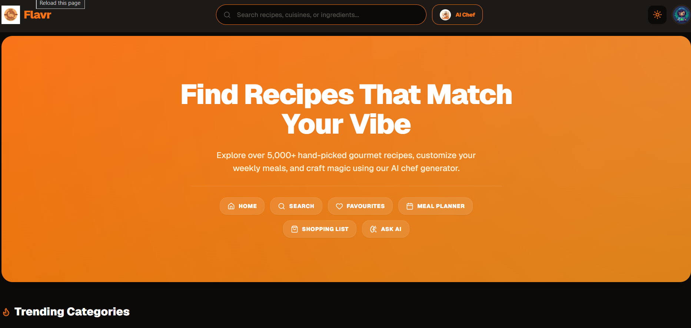
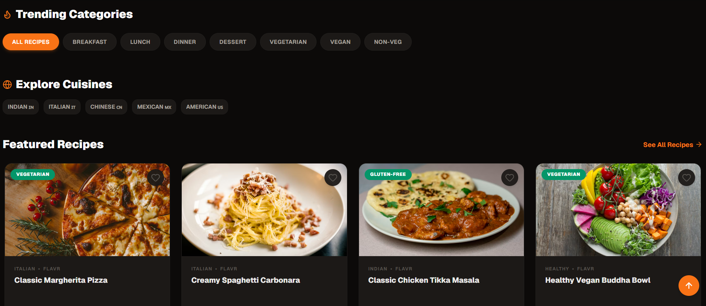
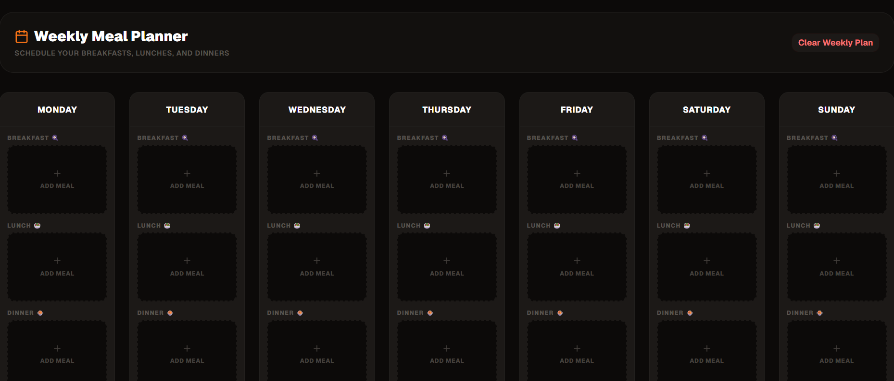
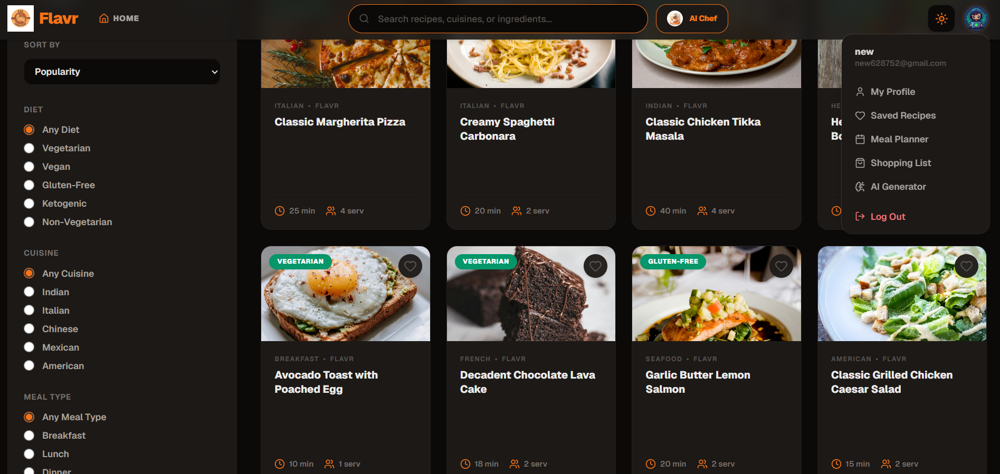

# 🍴 Flavr — Recipe Finder App

> **Find. Cook. Love.** — A full-stack recipe finder app with AI-powered recipe generation, meal planning, and more.

[](https://flavr-seven.vercel.app)
[](https://github.com/HinduPatrini/Flavr)
[](https://www.linkedin.com/in/hindu-patrini-7ab07a37a)

---

## 🍽️ About

**Flavr** is a full-stack recipe finder web application that allows users to discover, save, and cook recipes from around the world. It features AI-powered recipe generation, weekly meal planning, a shopping list generator, and much more — all wrapped in a premium, responsive UI.

Built as a portfolio project to demonstrate full-stack development skills using the **MERN stack**.

🔗 **Live App** → [https://flavr-seven.vercel.app](https://flavr-seven.vercel.app)
📦 **GitHub** → [https://github.com/HinduPatrini/Flavr](https://github.com/HinduPatrini/Flavr)

---

## 📸 Screenshots

### Home Page

> Hero section with search bar, featured recipes, and category filters

### Recipe Detail

> Full recipe details with ingredients, preparation steps, nutrition facts, and reviews

### Weekly Meal Planner

> Plan your weekly meals with breakfast, lunch, and dinner slots for every day

### Filters & Sidebar

> Mobile sidebar navigation and advanced recipe filters

---

## ✨ Features

### Core Features
- 🔍 **Search Recipes** — Search by name with instant autocomplete suggestions
- 📖 **Recipe Details** — Ingredients, step-by-step instructions, preparation steps, nutrition facts
- 🎛️ **Category Filters** — Vegetarian, Vegan, Non-Veg, Dessert, Breakfast, Lunch, Dinner
- 🌍 **Cuisine Filters** — Indian, Italian, Chinese, Mexican, American
- 🖼️ **High Quality Images** — Beautiful food images for every recipe

### Advanced Features
- 🥕 **Ingredient-Based Search** — Enter ingredients you have and get matching recipes
- ❤️ **Favorites System** — Save recipes with persistent storage in MongoDB
- 🔐 **User Authentication** — Register, Login with JWT + Google OAuth
- 📅 **Meal Planner** — Plan your weekly meals (Breakfast, Lunch, Dinner)
- 🛒 **Shopping List** — Auto-generate ingredient shopping lists from recipes
- 🤖 **AI Recipe Generator** — Generate custom recipes from available ingredients using Groq AI (Llama 3.3)
- ⭐ **Ratings & Reviews** — Rate and review recipes
- 🕐 **Recently Viewed** — Track your recently viewed recipes
- 🔗 **Share Recipe** — Share recipes via social media or copy link

### Portfolio-Boosting Features
- 🌙 **Dark / Light Mode** — Toggle between themes
- 📱 **Fully Responsive** — Mobile, tablet, and desktop support
- 📲 **Mobile Sidebar** — Slide-in sidebar with full navigation on mobile
- ♾️ **Pagination** — Load more recipes seamlessly
- 💀 **Loading Skeletons** — Smooth UX while data loads
- 🔒 **Auth Gate** — Blur + modal prompts login for protected actions
- ⚡ **Caching** — Faster repeated searches with node-cache
- 🎭 **Animations** — Smooth transitions with Framer Motion

---

## 🛠️ Tech Stack

### Frontend
| Technology | Purpose |
|---|---|
| React + Vite | Frontend framework |
| Tailwind CSS v3 | Styling |
| shadcn/ui | UI components |
| Redux Toolkit | State management |
| React Router DOM | Navigation |
| Axios | API calls |
| Framer Motion | Animations |
| Lucide React | Icons |
| React Hot Toast | Notifications |

### Backend
| Technology | Purpose |
|---|---|
| Node.js + Express | Server framework |
| MongoDB + Mongoose | Database |
| JWT + bcryptjs | Authentication |
| Passport.js | Google OAuth |
| Groq AI — Llama 3.3 | AI recipe generation |
| Spoonacular API | Recipe data |
| Cloudinary | Image uploads |
| node-cache | API response caching |

### Deployment
| Service | Purpose |
|---|---|
| Vercel | Frontend hosting |
| Render | Backend hosting |
| MongoDB Atlas | Cloud database |

---

## 📁 Folder Structure

```
Flavr/
├── assets/                    # Screenshots for README
│   ├── ss1.png
│   ├── ss2.png
│   ├── ss3.png
│   └── ss4.png
│
├── server/                    # Backend
│   ├── config/
│   │   ├── db.js              # MongoDB connection
│   │   └── passport.js        # Google OAuth config
│   ├── controllers/           # Route handlers
│   │   ├── authController.js
│   │   ├── recipeController.js
│   │   ├── mealPlanController.js
│   │   ├── reviewController.js
│   │   ├── shoppingListController.js
│   │   └── aiController.js
│   ├── middleware/
│   │   └── authMiddleware.js  # JWT protection
│   ├── models/                # MongoDB schemas
│   │   ├── User.js
│   │   ├── MealPlan.js
│   │   ├── Review.js
│   │   └── ShoppingList.js
│   ├── routes/                # API routes
│   │   ├── authRoutes.js
│   │   ├── recipeRoutes.js
│   │   ├── mealPlanRoutes.js
│   │   ├── reviewRoutes.js
│   │   ├── shoppingRoutes.js
│   │   └── aiRoutes.js
│   ├── .env                   # Environment variables
│   └── server.js              # Entry point
│
└── client/                    # Frontend
    ├── src/
    │   ├── api/
    │   │   └── axios.js       # Axios instance with interceptors
    │   ├── assets/            # Images and static files
    │   ├── components/
    │   │   ├── layout/        # Navbar, Sidebar, BottomNav, Footer
    │   │   ├── recipe/        # RecipeCard, RecipeGrid, Skeleton
    │   │   ├── auth/          # AuthModal, GoogleButton
    │   │   └── shared/        # SearchBar, FilterSidebar, CategoryPills
    │   ├── hooks/
    │   │   ├── useAuthGate.js # Auth gate hook
    │   │   └── useDebounce.js # Search debounce hook
    │   ├── pages/
    │   │   ├── Home.jsx
    │   │   ├── Search.jsx
    │   │   ├── RecipeDetail.jsx
    │   │   ├── Login.jsx
    │   │   ├── Register.jsx
    │   │   ├── AuthCallback.jsx
    │   │   ├── SavedRecipes.jsx
    │   │   ├── MealPlanner.jsx
    │   │   ├── ShoppingList.jsx
    │   │   ├── AIGenerator.jsx
    │   │   └── Profile.jsx
    │   ├── store/
    │   │   ├── store.js
    │   │   ├── authSlice.js
    │   │   ├── recipeSlice.js
    │   │   ├── uiSlice.js
    │   │   ├── mealPlanSlice.js
    │   │   ├── shoppingSlice.js
    │   │   └── reviewSlice.js
    │   ├── utils/
    │   │   └── helpers.js
    │   ├── App.jsx
    │   └── main.jsx
    ├── .env                   # Frontend environment variables
    └── vercel.json            # Vercel routing config
```

---

## 🚀 Getting Started

### Prerequisites
- Node.js v18+
- MongoDB Atlas account
- Spoonacular API key
- Groq API key
- Google OAuth credentials
- Cloudinary account

### Clone the Repository
```bash
git clone https://github.com/HinduPatrini/Flavr.git
cd Flavr
```

### Setup Backend
```bash
cd server
npm install
```

Create `.env` file in `server/` folder:
```env
PORT=5000
MONGO_URI=your_mongodb_connection_string
JWT_SECRET=your_jwt_secret
SPOONACULAR_API_KEY=your_spoonacular_key
CLOUDINARY_CLOUD_NAME=your_cloud_name
CLOUDINARY_API_KEY=your_cloudinary_api_key
CLOUDINARY_API_SECRET=your_cloudinary_api_secret
GOOGLE_CLIENT_ID=your_google_client_id
GOOGLE_CLIENT_SECRET=your_google_client_secret
GROQ_API_KEY=your_groq_api_key
CLIENT_URL=http://localhost:5173
```

Run backend:
```bash
npm run dev
```

### Setup Frontend
```bash
cd client
npm install
```

Create `.env` file in `client/` folder:
```env
VITE_API_URL=http://localhost:5000
VITE_GOOGLE_CLIENT_ID=your_google_client_id
```

Run frontend:
```bash
npm run dev
```

### Open in Browser
```
Frontend → http://localhost:5173
Backend  → http://localhost:5000
```

---

## 🔑 Environment Variables

### Backend (`server/.env`)

| Variable | Description |
|---|---|
| `PORT` | Server port (5000) |
| `MONGO_URI` | MongoDB Atlas connection string |
| `JWT_SECRET` | Secret key for JWT tokens |
| `SPOONACULAR_API_KEY` | API key from spoonacular.com |
| `CLOUDINARY_CLOUD_NAME` | Cloudinary cloud name |
| `CLOUDINARY_API_KEY` | Cloudinary API key |
| `CLOUDINARY_API_SECRET` | Cloudinary API secret |
| `GOOGLE_CLIENT_ID` | Google OAuth client ID |
| `GOOGLE_CLIENT_SECRET` | Google OAuth client secret |
| `GROQ_API_KEY` | Groq AI API key |
| `CLIENT_URL` | Frontend URL for CORS |

### Frontend (`client/.env`)

| Variable | Description |
|---|---|
| `VITE_API_URL` | Backend API base URL |
| `VITE_GOOGLE_CLIENT_ID` | Google OAuth client ID |

---

## 🔗 Links

[](https://flavr-seven.vercel.app)
[](https://github.com/HinduPatrini/Flavr)
[](https://www.linkedin.com/in/hindu-patrini-7ab07a37a)

---

## ⭐ Show Your Support

If you found this project helpful, please give it a ⭐ on GitHub!
